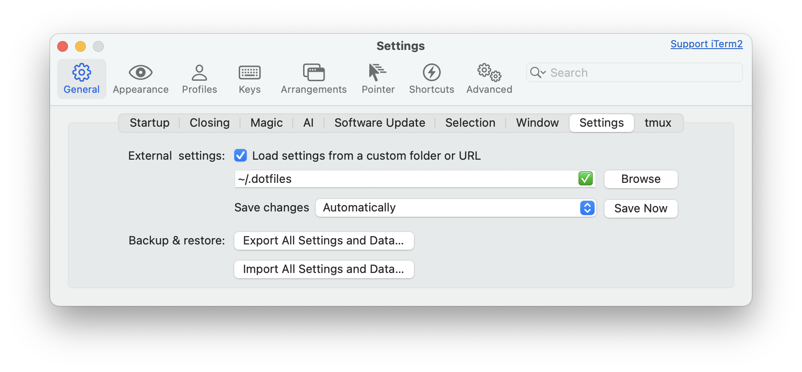
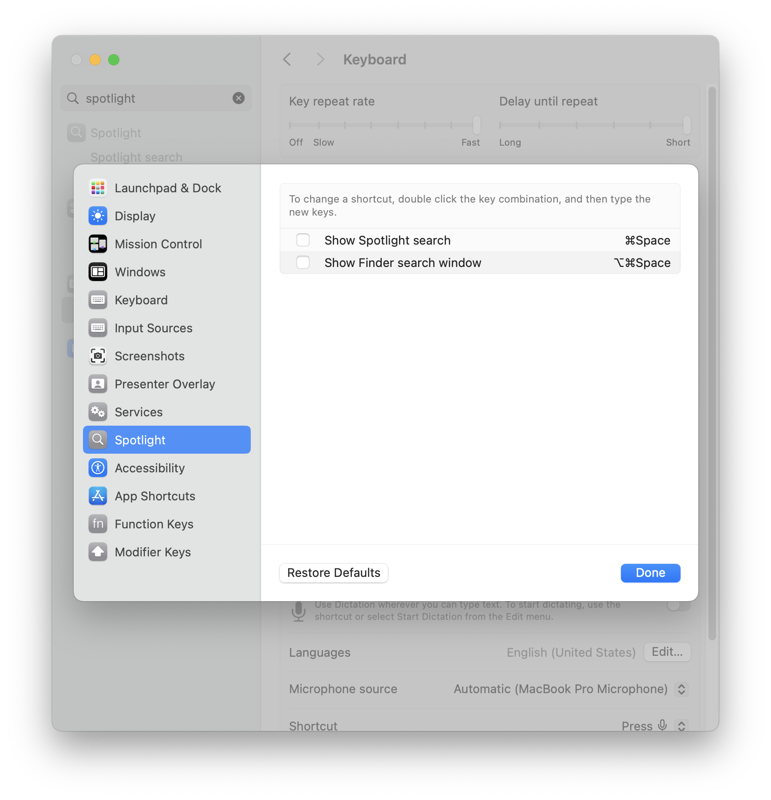
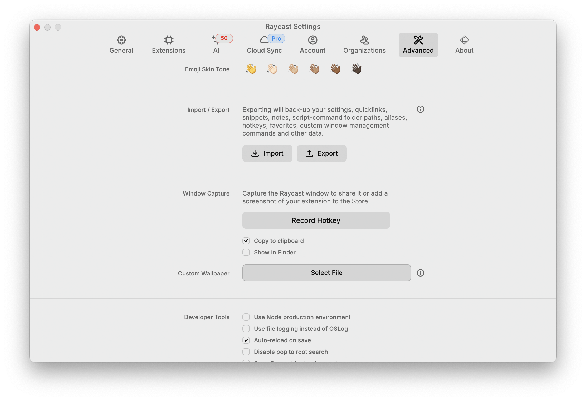

## Install

### Install brew

```bash
/bin/bash -c "$(curl -fsSL https://raw.githubusercontent.com/Homebrew/install/HEAD/install.sh)"
```

### Install iTerm2

```bash
brew install --cask iterm2
```

### Install classic tools

```bash
brew install git zsh stow zoxide fzf bat ffmpeg thefuck font-fira-code-nerd-font font-fira-code starship
```

### Setup ZSH

```bash
# Oh my zsh
sh -c "$(curl -fsSL https://raw.githubusercontent.com/ohmyzsh/ohmyzsh/master/tools/install.sh)"

# Plugins
git clone https://github.com/Ayc0/zsh-ayc0 ${ZSH_CUSTOM:-~/.oh-my-zsh/custom}/plugins/ayc0
git clone https://github.com/zsh-users/zsh-autosuggestions ${ZSH_CUSTOM:-~/.oh-my-zsh/custom}/plugins/zsh-autosuggestions
git clone https://github.com/zsh-users/zsh-syntax-highlighting.git ${ZSH_CUSTOM:-~/.oh-my-zsh/custom}/plugins/zsh-syntax-highlighting
git clone https://github.com/TamCore/autoupdate-oh-my-zsh-plugins $ZSH_CUSTOM/plugins/autoupdate
git clone --depth=1 https://github.com/ntnyq/omz-plugin-pnpm.git ${ZSH_CUSTOM:-$HOME/.oh-my-zsh/custom}/plugins/pnpm

# Spaceship Prompt – commented as there is starship now
# git clone https://github.com/spaceship-prompt/spaceship-prompt.git "$ZSH_CUSTOM/themes/spaceship-prompt" --depth=1
# ln -s "$ZSH_CUSTOM/themes/spaceship-prompt/spaceship.zsh-theme" "$ZSH_CUSTOM/themes/spaceship.zsh-theme"
```

### Raycast

Go to https://www.raycast.com/ and click on " Download"

## Setup

### Setup dotfiles

```bash
git clone git@github.com:Ayc0/Dotfiles.git ~/.dotfiles
cd ~/.dotfiles
stow .
```

### ZSH

Add this to your `~/.zshrc`:

```zsh
source ~/.config/zshrc
```

### Git

Add this to your `~/.gitconfig`:

```config
[include]
	path = ~/.config/git/config
```

### iTerm2

In iTerm2 settings, go to: "General" > "Settings", and enable "External Settings" > "Load settings from a custom folder or URL" with `~/.dotfiles`. And "Save changes "Automatically"



### Raycast

First, disable the regular shortcut for Spotlight:



Then import settings from `~/.dotfiles/Raycast.rayconfig`:


